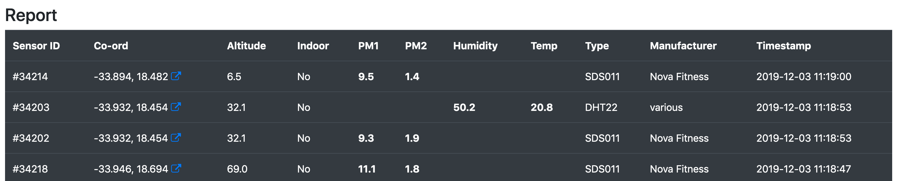

# Open Air
> Report on air quality sensors in Africa using APIs of open data projects.

## Project website

- [michaelcurrin.github.io/open-air](https://michaelcurrin.github.io/open-air/)

### Sample screenshot



## Background

This project exists because I went to a workshop in South Africa where air quality sensors were put together. These sensors contribute air quality measurement data to the [luftdaten.info](https://luftdaten.info) project. This data and those of other countries is made available through their APIs. This projects makes it easy to see the measurements of the South African (`ZA`) sensors.

This was later expanded to include the Open Africa site's data too for several African countries.

## Local development

### Libraries

- [Jekyll](https://jekyllrb.com/) - To build the static site. No Jekyll templating or themes are used though.
- Bootstrap - To add styling to the tables (from [tutorial](https://getbootstrap.com/docs/4.3/content/tables/)), the navbar (from [tutorial](https://getbootstrap.com/docs/4.3/components/navbar/#toggler)) and to the page overall.
- JQuery - To handle fetching JSON data.
- Mustache JS - To create tables easily using a template and dynamic data.

### Setup

1. Clone the project from the original or a fork. For example:
    ```bash
    $ git clone git@github.com:MichaelCurrin/open-air.git
    ```
2. Install [Jekyll](https://jekyllrb.com/) globally.

### Run

1. Start the server.
    ```bash
    $ cd <PATH_TO_REPO>
    $ jekyll serve
    ```
1. Open this URL in the browser.
    - http://127.0.0.1:4000


## Setup on Github Pages

1. Use this repo or a fork on Github Pages.
2. Go to Settings.
3. Go to Github Pages section.
4. Enable website using `master` branch. The page will reload.
5. Navigate to the section again and use the URL you see.

## Future development

This project could be expanded to allow a user choice of country using a droplist. And the date range could be changed to be say 24 hours.

## License

[MIT License](LICENSE)

Feel free to fork this project and submit a PR with improvements. Or use this as a template for your own data project, with a link back this this repo.
